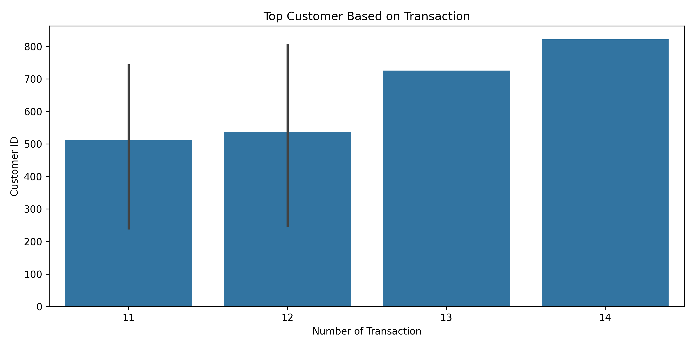
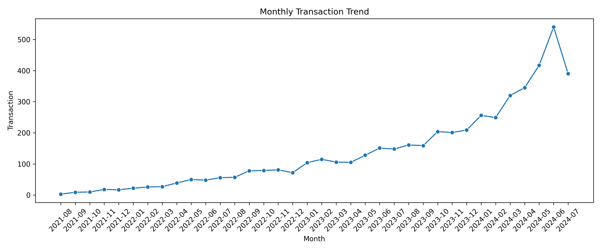
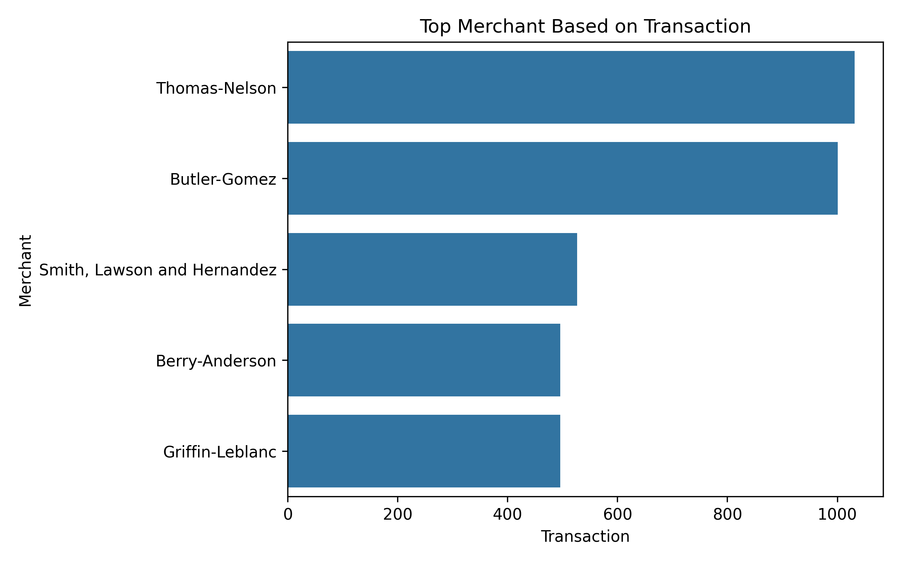

# E-Commerce Customer & Transaction Analytics: Business Insights Using Python

## Project Overview

This project analyzes e-commerce transaction data to discover customer behavior patterns, merchant performance, city-level transaction distribution, and promotional effectiveness.

The project implements an end-to-end data analytics workflow starting from raw dataset loading, data preprocessing, exploratory analysis, business metric calculation, and visualization generation using Python.

## Business Objectives

The main objectives of this project are:

- Understand customer transaction behavior
- Identify high-value and active customers
- Analyze transaction performance across cities
- Evaluate merchant transaction contribution
- Identify monthly transaction trends
- Analyze customer demographic patterns
- Measure coupon utilization effectiveness

## Business Questions

This project aims to answer the following questions:

1. Which customers have the highest transaction activity?
2. Which cities contribute the largest transaction volume?
3. Which merchants dominate transaction activity?
4. How does transaction activity change over time?
5. Which customer groups contribute the most transactions?
6. How effective are promotional coupons based on burn rate?

# Dataset

The dataset consists of several relational tables:

| Table        | Description                 |
| ------------ | --------------------------- |
| customers    | Customer information        |
| transactions | Transaction records         |
| cities       | City information            |
| genders      | Customer gender information |
| branches     | Branch information          |
| merchants    | Merchant information        |

The tables are integrated into a single analytical dataset through data preprocessing and relational merging.

# Project Workflow

The analytical pipeline consists of four main stages:

## 1. Data Loading

Module:

```
src/data_loader.py
```

Responsibilities:

- Load Excel dataset
- Read multiple relational tables
- Validate dataset availability

## 2. Data Preprocessing

Module:

```
src/preprocessing.py
```

Responsibilities:

- Merge transaction data with dimension tables
- Remove duplicated records
- Handle missing values
- Convert transaction date format
- Create additional features such as monthly transaction period

## 3. Business Analysis

Module:

```
src/analysis.py
```

Responsibilities:

- Calculate business KPI
- Customer transaction ranking
- City performance analysis
- Merchant performance analysis
- Customer activity analysis
- Gender transaction analysis
- Coupon burn rate calculation
- Generate business summary

## 4. Data Visualization

Module:

```
src/visualization.py
```

Responsibilities:

- Generate analytical charts
- Visualize customer ranking
- Visualize city performance
- Visualize merchant performance
- Display transaction trends
- Create business report images

# Technologies Used

## Programming Language

- Python

## Libraries

| Library    | Purpose                        |
| ---------- | ------------------------------ |
| Pandas     | Data manipulation and analysis |
| NumPy      | Numerical computation          |
| Matplotlib | Data visualization             |
| Seaborn    | Statistical visualization      |

# Project Structure

```
ecommerce-analytics/

│
├── src/
│   ├── data_loader.py
│   ├── preprocessing.py
│   ├── analysis.py
│   └── visualization.py
│
├── reports/
│   └── images/
│       ├── top_customer.png
│       ├── top_city.png
│       ├── top_merchant.png
│       ├── monthly_transaction.png
│       └── gender_transaction.png
│
├── main.py
│
├── eCommerceData.xlsx
│
└── README.md
```

# Key Analysis Performed

## Customer Analysis

Analyzed:

- Top customers based on transaction frequency
- Customer activity level
- Customer distribution across cities

## City Analysis

Analyzed:

- Transaction volume by city
- Number of unique customers per city
- Average transactions per customer

## Merchant Analysis

Analyzed:

- Top-performing merchants
- Merchant customer reach
- Merchant transaction contribution

## Time Series Analysis

Analyzed:

- Monthly transaction trends
- Growth patterns over time

## Promotion Analysis

Calculated:

```
Burn Rate =
Used Coupon / Available Coupon × 100%
```

to measure promotional effectiveness.

# Example Visualization

## Top Customer Transaction



## Transaction Trend



## Merchant Performance



# How To Run The Project

## 1. Clone Repository

```bash
git clone https://github.com/GemaSatya/E-Commerce-Customer-Transaction-Analytics-Business-Insights-Using-Python.git
```

Navigate into project folder:

```bash
cd ecommerce-analytics
```

## 2. Install Dependencies

```bash
pip install -r requirements.txt
```

## 3. Run Analysis

```bash
python main.py
```

The generated visualization files will be stored in:

```
reports/images/
```

# Future Improvements

Future development plans:

- Build interactive dashboard using Streamlit
- Add customer segmentation using RFM analysis
- Develop customer churn prediction model
- Integrate SQL database
- Create automated reporting pipeline
- Deploy analytics dashboard

# Author

Gema Satya

Data Analyst Portfolio Project
